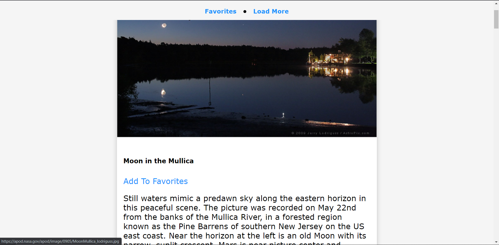

# nasaApi

## Description

A project that uses the NASA api to display images to the user. The user can save a selected image to their favorites. The favorite images are stored in local storage. The user can delete the images from local storage and the user can also make a request to the api to load more images. The api returns 10 pictures at each api call. The following is used in the project:

- Fetch API
- Async/Await
- NASA API
- DOM Inseration and Removable
- Local Storage

## Demo

A demo of the project can be found here: https://tod619.github.io/nasaApi/
